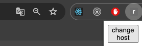

<h3 align="center">Chrome-Localhost-Swap</h3>

## About The Project

A simple extension for chrome that will replace the origin of the url with localhost

Here's why:
* Perhaps the project you are working on is too slow to navigate on localhost, so you navigate to the live one and when you finally reach the page you were looking for you simply swap to localhost
* Lets say in a monitor tool you get an error about a page and you want to test is quickly on localhost, you open it live and then you swap to localhost 

## Getting Started

### Installation

_Below is an example of how you can instruct your audience on installing and setting up your app. This template doesn't rely on any external dependencies or services._

1. Clone the repo 

    (with https)
   ```sh
   git clone https://github.com/agkamitsios/chrome-localhost-swap.git
   ```
   (with ssh)
   ```sh
   git clone git@github.com:agkamitsios/chrome-localhost-swap.git
   ```

## Usage
1. once you've cloned the repo you can go to the `manage extensions` in chrome

    

2. After that make sure to enable the `developer mode` and click on the `Load unpacked`

    
   
3. Then you can will see a popup to select the extension directory. You will add the cloned repo and if all goes well you will see it in the active extensions

    
   
4. Now in your desired page you can click on the newly added extension

   

5. And this beautiful button will show up, click it and your page will go from whatever origin it is to localhost

   

6. You can also press the middle click (or ctr/cmd + click) to open the page in a new tab in localhost

7. A new context menu is also added when you right click on a link in a page, that allows you to open the link in localhost
   

8. The default port is 3000 but you can change it through the extension's settings

   
